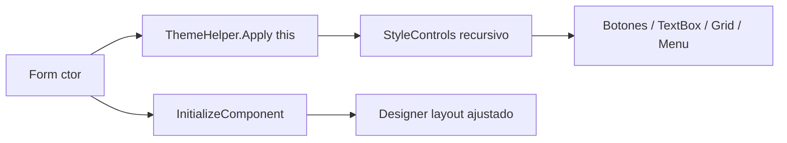

# Requirements

### Overview & Goals
Dar un aspecto profesional y moderno a la aplicación de escritorio WinForms (VS 2010, proyecto `Vistas`) **sin tocar la lógica ni el backend**, aplicando el principio *mínimo esfuerzo / máximo impacto visual*. Se apoya en la infraestructura ya existente (`Vistas/ThemeHelper.cs`, invocado desde el constructor de todos los formularios).

### Scope
**In Scope**
- Ajustes visuales sobre controles estándar de WinForms.
- Refinar y extender `ThemeHelper` (paleta neutra, tipografía, botones planos, grillas, menús).
- Corregir alineación y espaciado en los formularios.

**Out of Scope**
- Cambios de lógica de negocio, acceso a datos o consultas SQL.
- Librerías de terceros (MetroFramework, Guna, DevExpress) — se usan solo controles estándar.

### Las 5 mejoras solicitadas

**1. Tipografía legible y consistente (Segoe UI)**
- *Por qué funciona:* una única familia tipográfica moderna elimina el aspecto "Windows 98" de Microsoft Sans Serif y mejora la jerarquía y legibilidad.
- *Implementación en VS 2010:* en `ThemeHelper` reemplazar la fuente de cada control por `FuenteBase` (`Segoe UI 9pt`); títulos con `FuenteTitulo` (bold, 13.5pt). Propiedad `Control.Font`.

**2. Paleta de colores neutra con un único acento**
- *Por qué funciona:* fondos off-white y un solo azul de acento reducen el ruido visual y dirigen la atención a las acciones importantes.
- *Implementación en VS 2010:* usar `ColorFondo`, `ColorTexto`, `ColorPrimario` de `ThemeHelper`. Propiedades `Form.BackColor`, `Control.ForeColor`, `Button.BackColor`.

**3. Botones planos con jerarquía primario/secundario y hover**
- *Por qué funciona:* el estilo *flat* moderniza al instante y distinguir el botón principal guía al usuario hacia la acción esperada.
- *Implementación en VS 2010:* `Button.FlatStyle = Flat`, `FlatAppearance.BorderColor`, `FlatAppearance.MouseOverBackColor`, `Cursor = Hand`.

**4. Espaciado y alineación coherentes (el mayor pendiente)**
- *Por qué funciona:* el alineado en cuadrícula y márgenes uniformes transmiten prolijidad profesional; hoy los botones de `Principal` están dispersos (X=84 vs 287, tamaños 125×23 vs 141×25).
- *Implementación en VS 2010:* alinear `Location`/`Size` de los botones (o envolver en un `TableLayoutPanel`), unificar `Size` y aplicar `Padding`/`Margin` consistentes.

**5. Grillas (DataGridView) y menús limpios**
- *Por qué funciona:* cabeceras con color de acento, filas alternas y bordes sutiles hacen los listados legibles y modernos; un `MenuStrip`/`StatusStrip` estilizado remata el marco de la ventana.
- *Implementación en VS 2010:* `EnableHeadersVisualStyles=false`, `ColumnHeadersDefaultCellStyle`, `AlternatingRowsDefaultCellStyle`, `GridColor`; renderer plano para `MenuStrip`.

### Non-Functional Requirements
- No alterar el comportamiento funcional ni los handlers existentes.
- Compatible con .NET / VS 2010 y controles estándar.
- Cambios centralizados en `ThemeHelper` para mantenibilidad.

# Technical Design

### Current Implementation
- Proyecto `Vistas` (WinForms). Formularios: `Login`, `Principal`, `Clientes`, `Productos`, `ObrasSociales`, `FrmVentas`, `FrmUsuario`, `FrmListVentas`, `FrmListaProductos`, `FrmBuscarClientes`, `FrmClientesPorObraSocial`.
- Ya existe `Vistas/ThemeHelper.cs` con paleta, fuentes y estilado recursivo de `Button`, `TextBox`, `ComboBox`, `Label`, `DataGridView`, `GroupBox`, `Panel`, `TabControl`.
- `ThemeHelper.Apply(this)` ya se llama en el constructor de todos los formularios (verificado en 12 archivos).
- **Problema principal restante:** alineación/espaciado inconsistente en los `.Designer.cs` (ej. `Principal.Designer.cs`: botones en columnas X=84 y X=287 con tamaños y separaciones verticales irregulares) y falta de estilado para `MenuStrip`/`StatusStrip`.

### Key Decisions
- **Centralizar en `ThemeHelper`:** toda regla de color/tipografía/estilo vive en un solo lugar; los ajustes de posición van en los `.Designer.cs` de cada formulario. Rationale: mínimo esfuerzo, consistencia global.
- **Solo controles estándar:** no introducir dependencias externas. Rationale: requerimiento explícito y compatibilidad con VS 2010.
- **Alineación por ajuste de `Location`/`Size` (y `TableLayoutPanel` donde convenga):** preferir cuadrícula uniforme sin reescribir formularios completos.

### Proposed Changes
1. **`ThemeHelper`** — verificar/afinar tipografía y paleta ya presentes; añadir estilado para `MenuStrip`/`ToolStrip` (renderer plano, colores de acento) y `StatusStrip` si se usa.
2. **`Principal.Designer.cs`** — unificar tamaño de botones, alinearlos en una columna/grilla con separación vertical constante y márgenes uniformes; centrar `lblBienvenida` como título.
3. **Formularios de ABM y listados** — revisar `Location`/`Size`/`Anchor` de botones y grillas para alineación coherente y padding alrededor de los `DataGridView`.
4. **Marco de ventana** — títulos (`Form.Text`) descriptivos, `Icon`, `FormBorderStyle`/`MaximizeBox` coherentes.

### Components
- `ThemeHelper` (estático): punto único de estilo — se extiende, no se reescribe.
- `.Designer.cs` de cada `Form`: ajustes de layout/posición.

### File Structure
- Modificar: `Vistas/ThemeHelper.cs`.
- Modificar (layout): `Vistas/Principal.Designer.cs` y los `.Designer.cs` de los formularios de listado/ABM.
- Sin archivos nuevos.

### Architecture Diagram

### Risks
- Reglas heurísticas por texto de botón en `ThemeHelper` (ej. `Contains("buscar")`) pueden clasificar mal algún botón; mitigar revisando casos.
- Reubicar controles en `.Designer.cs` puede solaparse; validar visualmente cada formulario tras el ajuste.

# Testing

### Validation Approach
Al ser cambios visuales, la validación es principalmente compilación + inspección. El agente compilará la solución y revisará cada formulario afectado.

### Key Scenarios
- La solución compila sin errores tras los cambios (`LPOO1_GRUPO_10.sln`).
- `Principal` muestra los botones alineados, mismo tamaño y separación uniforme.
- Los formularios con `DataGridView` muestran cabecera de acento, filas alternas y bordes sutiles.
- Botones primarios (Guardar/Aceptar/Buscar) se distinguen de los secundarios y reaccionan al hover.

### Edge Cases
- Botones cuyo texto no encaja en la heurística primario/secundario.
- Formularios sin `DataGridView` o con `Panel`/`GroupBox` anidados (verificar recursión de `ThemeHelper`).
- Verificar que ningún handler de eventos fue removido al editar los `.Designer.cs`.

### Test Changes
- No hay proyecto de tests automatizados; la verificación es manual/visual + build.

# Delivery Steps

### ✓ Step 1: Refinar y extender ThemeHelper (tipografía, paleta, botones, menús)
ThemeHelper aplica de forma consistente tipografía Segoe UI, paleta neutra con acento, botones planos con hover y estilado de menús en todos los formularios.

- Verificar/afinar en `Vistas/ThemeHelper.cs` la asignación de `FuenteBase`/`FuenteTitulo` y de la paleta (`ColorFondo`, `ColorPrimario`, `ColorTexto`).
- Consolidar el estilo *flat* de botones y la distinción primario/secundario con hover.
- Añadir estilado para `MenuStrip`/`ToolStrip` (renderer plano y colores de acento) y `StatusStrip` si existe.
- Confirmar que `Apply(this)` sigue invocado en el constructor de los 12 formularios.

### ✓ Step 2: Estilizar listados (DataGridView) de forma coherente
Todos los DataGridView muestran cabecera con color de acento, filas alternas, bordes sutiles y selección de fila completa.

- Asegurar en `ThemeHelper` la configuración de `ColumnHeadersDefaultCellStyle`, `AlternatingRowsDefaultCellStyle`, `GridColor`, `EnableHeadersVisualStyles=false`.
- Revisar los formularios `FrmListVentas`, `FrmListaProductos`, `FrmClientesPorObraSocial`, `FrmBuscarClientes` para padding alrededor de la grilla.
- Validar visualmente legibilidad y alineación de columnas.

### ✓ Step 3: Corregir alineación y espaciado en Principal y ABMs
Los formularios presentan botones del mismo tamaño, alineados en cuadrícula con separación y márgenes uniformes.

- En `Vistas/Principal.Designer.cs` unificar `Size` de los botones y alinear `Location` en columna/grilla con separación vertical constante (hoy X=84 vs 287, tamaños 125×23 vs 141×25).
- Centrar `lblBienvenida` como título de la pantalla.
- Aplicar los mismos criterios de alineación/`Padding`/`Anchor` en los `.Designer.cs` de los formularios de ABM (`Clientes`, `Productos`, `ObrasSociales`, `FrmVentas`, `FrmUsuario`, `Login`).

### ✓ Step 4: Pulir el marco de ventana y verificar la build
Cada ventana tiene título descriptivo e ícono coherente, y la solución compila correctamente.

- Ajustar `Form.Text`, `Icon` y estilos de borde/`MaximizeBox` coherentes en los formularios.
- Revisar que no se hayan eliminado handlers de eventos al editar los `.Designer.cs`.
- Compilar `LPOO1_GRUPO_10.sln` y verificar ausencia de errores.